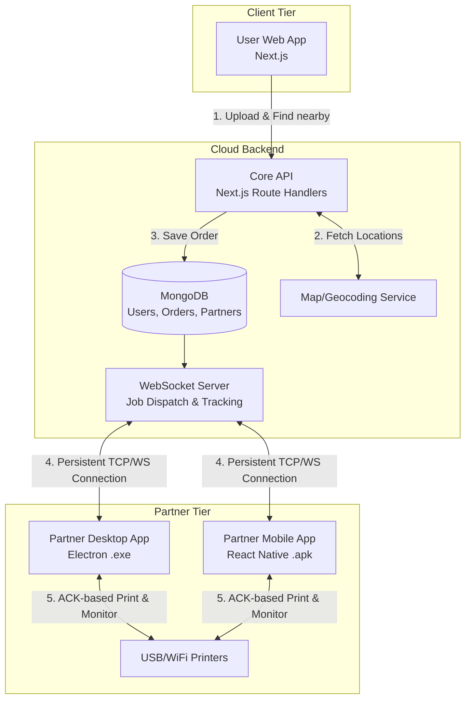
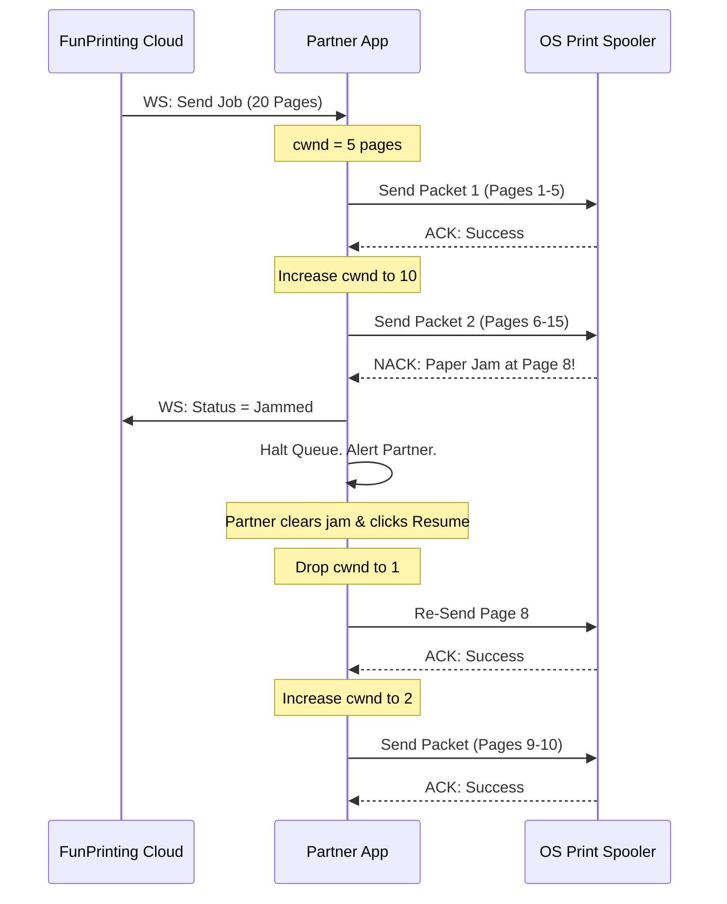

# Fun Printing - Marketplace System Design

## 1. Executive Summary
The goal is to transition "Fun Printing" from a single-retailer automated printing service to a **Hyperlocal Printing Marketplace** (similar to Zomato/Blinkit, but for in-store pickup). Customers will use the web platform to upload documents, select a nearby printing partner via an interactive map, and pay. The chosen partner will receive the print job on their dedicated Partner App (Desktop/Mobile), which will handle automated printing, dashboard analytics, and advanced error control.

## 2. High-Level Architecture

## 3. Component Design & Changes

### A. FunPrinting Core (Web & Backend)
**Current State:** Single tenant, direct integration with a single Printer-API instance via HTTP webhooks.
**New State:** Multi-tenant marketplace with location-based routing.

**Key Changes Required:**
1. **Database Schema Additions:**
   - `Partner` Model: Stores partner profile, GPS coordinates (GeoJSON point), active status, supported printers, and revenue stats.
   - `Order` Model Update: Add `partnerId`, `pickupCode`, and fine-grained statuses (`assigned`, `printing`, `jammed`, `ready_for_pickup`, `completed`).
2. **Location & Routing Logic:**
   - Integrate a free mapping library (e.g., OpenStreetMap via Leaflet.js or React-Leaflet) in the frontend to avoid paid API costs.
   - Use MongoDB `$near` geospatial queries to find partners within a specific radius of the user.
3. **Real-time Communication (WebSocket):**
   - Replace the current HTTP webhook model (which requires Ngrok/Cloudflare tunnels) with a **WebSocket (WS) Server** (e.g., using `Socket.io` or standard WS in Node.js).
   - Partner apps will act as *clients* connecting to the cloud, eliminating the need for complex network setups on the partner's end.

### B. Partner Application (Replacing Printer-API)
**Current State:** Node.js Express server running locally with a hardcoded static `.env` API Key, relying on incoming HTTP requests.
**New State:** A packaged Desktop App (.exe) and Mobile App (.apk) with dynamic User Authentication and secure outbound tunneling.

**Authentication & Zero-Config Networking:**
- **No More Static API Keys:** Because anyone can download the app and become a partner, the app will feature a standard Login/Sign-up screen (powered by NextAuth/JWT).
- **Dynamic Registration:** Upon logging in, the app receives a secure session token.
- **WebSocket Tunneling:** The Partner App opens an *outbound* WebSocket (WSS) connection to the FunPrinting cloud server using its session token. 
  - This eliminates the need for `ngrok`, port-forwarding, or exposing a local API on the partner's network.
  - The cloud server securely pushes print jobs down this established tunnel directly to the authenticated partner.

**Desktop App (Tech Stack: Electron + React + Node.js + Socket.io):**
*Electron is chosen over Tauri because it provides seamless access to native Node.js hardware/printer APIs without complex sidecars.*
- **UI Dashboard:** Displays daily/monthly page counts, total revenue, and live printer status.
- **Background Daemon:** Runs the Node.js printer logic, now listening to WebSocket events (Socket.io) instead of HTTP requests.
- **Printer Discovery:** Automatically lists connected USB and WiFi printers using OS-level commands (`lpstat`, `Get-Printer`).

**Mobile App (Tech Stack: React Native + Expo + Socket.io):**
- Geared towards partners who only have WiFi printers.
- **UI Dashboard:** Same analytics as desktop.
- **Printing:** Uses Android/iOS native Print APIs to send documents to local network printers.

## 4. "TCP-Like" Error Control & Print Resumption
To solve the problem of a PDF breaking (e.g., paper jam, out of paper) and resuming from the exact failed page, we will implement an **ACK-based sliding window protocol with Dynamic Congestion Control** (inspired by TCP Tahoe/Reno) between the Partner App and the OS Print Spooler.

Sending 1 page at a time is too slow, but sending 100 pages at once risks massive failure if the printer jams. We will use a dynamically resizing "packet" (batch of pages).

**How it works (AIMD - Additive Increase, Multiplicative Decrease):**
1. **Dynamic Packet Sizing (Congestion Window - `cwnd`):** 
   - The App starts by splitting the document and sending a packet of **5 pages**.
2. **Spooler Monitoring (The "ACK"):** 
   - On Windows: The app polls `Get-PrintJob` via PowerShell.
   - On Mac/Linux: The app polls `lpstat -W completed`.
3. **The Loop (Additive Increase):**
   - App sends Packet 1 (Pages 1-5).
   - If Spooler reports success (ACK), the App *increases* the packet size (e.g., to 10 pages) to maximize printing speed.
   - App sends Packet 2 (Pages 6-15).
4. **Error Handling (Multiplicative Decrease):**
   - If `Get-PrintJob` reports an error (e.g., `PaperJam` on page 8), the app halts the queue.
   - The UI flashes red: "Printer Error at Page 8. Please fix the printer."
   - The packet size instantly **drops to 1 page** (TCP Slow Start phase).
   - The Partner clears the jam and clicks "Resume".
   - The App re-sends Page 8 individually. If successful, it slowly ramps the packet size back up (1 -> 2 -> 5 -> 10).

## 5. Summary of Codebase Changes Needed
*Note: No code implementation is done as requested, this is the roadmap.*

1. **In `FunPrinting` (Web):**
   - **Admin Control Center Revamp:** Instead of a global list of all orders, the admin dashboard will now display **Partner Cards** initially. Clicking a specific Partner Card will drill down to show only the orders assigned to that partner.
   - Add `socket.io` server setup in Next.js (or a separate microservice).
   - Create a `/partner` route for onboarding and downloading the Partner App.
   - Build a `PartnerDashboard` frontend for partners to log in online.
   - Build a `LocationPicker` component using OpenStreetMap (OSM) for users to select a shop. 
   - Add a "Navigate to Partner" button that generates a standard Google Maps URL (e.g., `https://www.google.com/maps/dir/?api=1&destination=LAT,LNG`) to hand off turn-by-turn navigation to the user's native Google Maps app.
   - Update `razorpay` flow to capture `partnerId` and split payments (using Razorpay Route) if you intend to take a platform commission.

2. **Partner Onboarding Flow (The `/partner` route):**
   - **Landing Page:** A dedicated marketing page at `funprinting.store/partner` explaining the benefits of becoming a partner (earn money, automated printing).
   - **Download Links:** Clear buttons to "Download for Windows (.exe)", "Download for Mac (.dmg)", and "Download for Android (.apk)".
   - **Step-by-Step Guide:** 
     1. **Download & Install:** User downloads the app and installs it on the computer connected to their printer.
     2. **Sign Up/Log In:** User opens the app and creates an account.
     3. **Select Printer:** The app auto-detects connected printers; the user selects their primary printer and sets their pricing.
     4. **Go Online:** The user toggles their status to "Online" in the app.
     5. **Ready:** They will now appear on the customer Map and start receiving orders instantly via the WebSocket tunnel.

3. **In `Printer-API` (Migrating to Desktop App):**
   - Port the existing Express routes (`/api/print`) into WebSocket event listeners (`socket.on('new_job', ...)`).
   - Wrap the Node.js logic in an Electron shell.
   - Build a React frontend for the Electron app to show the Dashboard and Print Queue.
   - Upgrade `src/services/printer.ts` to implement the Page-by-Page splitting and Spooler polling logic for the TCP-like error recovery.

## 6. Execution Roadmap (Business App Implementation)
*Because we are building a robust business application (not a prototype), each phase must include full error handling, security, and both frontend/backend integration before moving to the next.*

### Phase 1: Foundation & Partner Registration
**Goal:** Allow printing shops to sign up and establish their profiles on the platform.
*   **Backend:** Update MongoDB schemas (`Partner`, `User`). Build secure API routes for partner registration, profile management (GPS coordinates, operating hours), and pricing configurations.
*   **Frontend:** Build the `/partner` onboarding landing page. Build the web-based Partner Dashboard where shop owners can log in, set their pricing, and view their profile.

### Phase 2: Location-Based Checkout Engine
**Goal:** Enable customers to find nearby shops and route their orders.
*   **Backend:** Implement MongoDB `$near` geospatial queries to fetch active partners within a user's radius.
*   **Frontend:** Integrate OpenStreetMap (Leaflet) into the checkout flow. Allow users to click a partner marker, view their specific pricing, and assign the order to that `partnerId`.

### Phase 3: Financial Routing & Platform Fees
**Goal:** Handle money securely and split payouts between the platform and the partner.
*   **Backend:** Upgrade the Razorpay integration using **Razorpay Route**. When a customer pays, automatically calculate the platform commission (e.g., 10%) and split the payout to the specific partner's linked bank account.
*   **Frontend:** Refine the post-payment Success UI. Implement the "Navigate to Partner" Google Maps handoff button on the Order Tracking page.

### Phase 4: The Zero-Config WebSocket Tunnel
**Goal:** Establish the secure, real-time pipeline between the Cloud and the Partner's computer.
*   **Backend:** Deploy a Socket.io server. Implement JWT-based authentication for socket connections. Create a Redis/Memory registry tracking which `partnerId` is connected to which Socket ID.
*   **Frontend (Cloud):** Update the Order processing webhook to push the document URL down the specific partner's WebSocket tunnel immediately after payment.

### Phase 5: Partner Desktop App (MVP)
**Goal:** Replace `Printer-API` with a distributable, secure desktop application.
*   **App Frontend:** Scaffold an Electron + React app. Build the Login screen (NextAuth). Build the UI showing connected printers and the live job queue.
*   **App Backend (Node daemon):** Port the existing OS hardware commands (`lpstat`, `Get-Printer`) from `Printer-API`. Connect the app to the Phase 4 WebSocket server as a client.

### Phase 6: TCP-Like Hardware Error Control (The Hard Part)
**Goal:** Implement the automated, fault-tolerant printing algorithm.
*   **App Backend:** Implement the AIMD (Additive Increase, Multiplicative Decrease) dynamic batching algorithm. Implement the OS spooler polling loop. Halt the queue locally on a NACK (Paper Jam) and allow manual resume.
*   **Cloud & Frontend:** The App streams live status ("Printing Page 5", "Paper Jam") back up the WebSocket. The Customer tracking page updates in real-time so they know exactly what's happening at the shop.

### Phase 7: Franchise Admin Control Center
**Goal:** Give you (the platform owner) ultimate operational oversight.
*   **Backend:** Build aggregation APIs to calculate platform revenue, total pages printed, and partner health scores.
*   **Frontend:** Revamp the Admin page. Build the high-level grid of Partner Cards. Clicking a card drills down into that specific shop's order history, uptime, and dispute resolutions.
